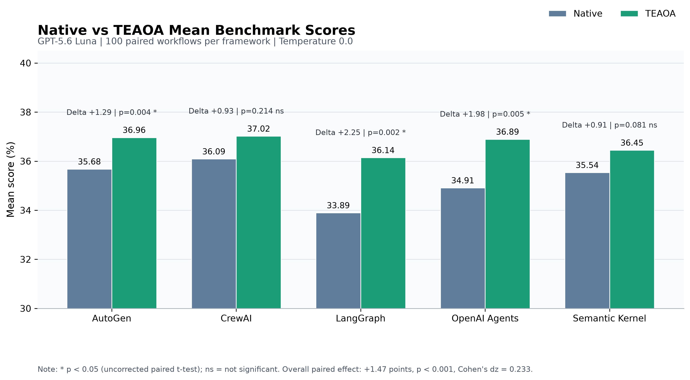
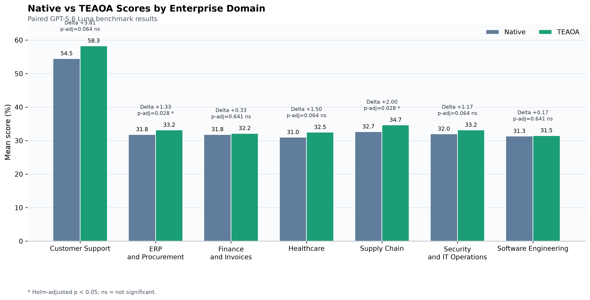
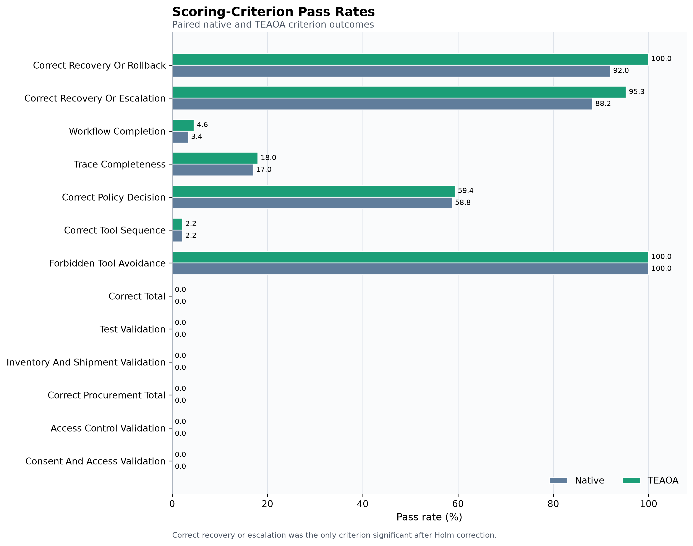
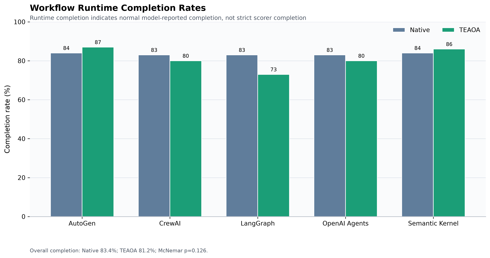
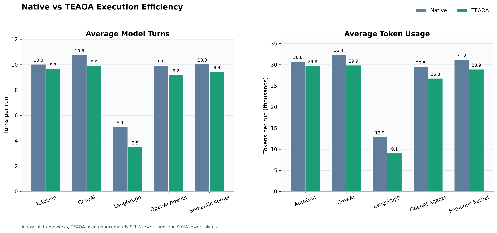

# GPT-5.6 Luna Experiment Results

## Experimental scope

The controlled experiment evaluated 100 enterprise workflows across five agent frameworks and two configurations using GPT-5.6 Luna at temperature 0.0. The complete matrix contained 1,000 runs:

`100 workflows x 5 frameworks x 2 configurations x 1 repetition = 1,000 runs`

The frameworks were AutoGen, CrewAI, LangGraph, OpenAI Agents, and Semantic Kernel. Each framework was evaluated in its native configuration and with TEAOA governance controls.

All 1,000 runs completed successfully. Statistical comparisons used 500 matched native-TEAOA pairs.

## Overall score comparison

Across all frameworks, the native configuration achieved a mean score of 35.22%, while TEAOA achieved 36.69%. The paired improvement was 1.47 percentage points (95% CI: 0.92 to 2.03). This difference was statistically significant (paired t-test, p < 0.001), with a small standardized effect (Cohen's dz = 0.233). Observed power was 0.999.

| Framework | Native mean (%) | TEAOA mean (%) | Difference | Paired p-value | Cohen's dz | Interpretation |
|---|---:|---:|---:|---:|---:|---|
| AutoGen | 35.68 | 36.96 | +1.29 | 0.004 | 0.293 | Significant improvement |
| CrewAI | 36.09 | 37.02 | +0.93 | 0.214 | 0.125 | Not significant |
| LangGraph | 33.89 | 36.14 | +2.25 | 0.002 | 0.319 | Significant improvement |
| OpenAI Agents | 34.91 | 36.89 | +1.98 | 0.005 | 0.284 | Significant improvement |
| Semantic Kernel | 35.54 | 36.45 | +0.91 | 0.081 | 0.176 | Not significant |

After Holm correction across the five framework comparisons, AutoGen, LangGraph, and OpenAI Agents remained statistically significant. CrewAI and Semantic Kernel did not.

## Enterprise-domain comparison

TEAOA produced positive mean-score differences in all seven enterprise domains. After Holm correction, ERP and Procurement and Supply Chain showed statistically significant improvements.

| Domain | Native mean (%) | TEAOA mean (%) | Difference | Holm-adjusted p-value | Interpretation |
|---|---:|---:|---:|---:|---|
| Customer Support | 54.48 | 58.28 | +3.81 | 0.064 | Positive trend |
| ERP and Procurement | 31.83 | 33.17 | +1.33 | 0.028 | Significant improvement |
| Finance and Invoices | 31.83 | 32.17 | +0.33 | 0.641 | Not significant |
| Healthcare | 31.00 | 32.50 | +1.50 | 0.064 | Positive trend |
| Supply Chain | 32.67 | 34.67 | +2.00 | 0.028 | Significant improvement |
| Security and IT Operations | 32.00 | 33.17 | +1.17 | 0.064 | Positive trend |
| Software Engineering | 31.33 | 31.50 | +0.17 | 0.641 | Not significant |

## Governance-criterion comparison

The strongest criterion-level effect occurred for correct recovery or escalation. Its pass rate increased from 88.24% under native execution to 95.29% with TEAOA, a gain of 7.06 percentage points. The effect remained significant after Holm correction (adjusted p < 0.000001), with a matched odds ratio of 13.0.

Forbidden-tool avoidance was 100% in both configurations. Correct policy decisions increased slightly from 58.8% to 59.4%, but the change was not significant. No other criterion remained significant after correction.

## Completion and execution efficiency

Runtime completion decreased from 83.4% under native execution to 81.2% with TEAOA. The 2.2-percentage-point difference was not statistically significant (exact McNemar p = 0.126). Consequently, the evidence does not support a claim that TEAOA improves runtime completion frequency.

TEAOA required approximately 9.1% fewer model turns and 9.0% fewer tokens across all frameworks. Average turns decreased from 9.17 to 8.34 per run, while average token usage decreased from approximately 27,348 to 24,875 tokens per run.

## Interpretation

The Luna experiment provides evidence that TEAOA improves governance-sensitive benchmark quality and execution efficiency. The overall score improvement was statistically reliable but small, and its magnitude varied by framework and enterprise domain. The most pronounced governance benefit was improved recovery or escalation behavior. TEAOA did not significantly improve runtime completion.

These findings support a measured conclusion: TEAOA can improve the quality and efficiency of controlled agent workflows, but its benefits are framework-dependent and do not automatically translate into higher completion rates.

## Limitations

- Only one model, GPT-5.6 Luna, was evaluated in this experiment.
- Temperature was fixed at 0.0 and each matrix combination had one repetition.
- Framework observations share workflows, so framework-specific results should be interpreted as paired controlled comparisons rather than independent datasets.
- Several strict domain-specific scoring criteria had 0% pass rates in both configurations, creating floor effects and preventing discrimination between native and TEAOA execution for those criteria.
- Runtime completion and strict scorer completion measure different concepts. Runtime completion indicates normal model-reported termination, while strict scorer completion requires all ground-truth workflow conditions.
- The observed effect sizes were generally small.
- A second-model experiment is required to assess whether the findings generalize beyond GPT-5.6 Luna.

## Reproducibility artifacts

- `luna_run_scores.csv`: run-level score and efficiency data.
- `luna_summary_by_framework_configuration.csv`: framework/configuration aggregates.
- `paired_statistical_results.csv` and `.json`: paired framework-level statistical results.
- `domain_analysis/`: domain-level paired datasets and statistical reports.
- `criterion_analysis/`: criterion-level records, pairs, and statistical reports.
- `figures/`: report-ready PNG and PDF visualizations.
- `scripts/analyze_luna_results_v2.py`: overall paired analysis.
- `scripts/analyze_luna_domains_v2.py`: enterprise-domain analysis.
- `scripts/analyze_luna_criteria_v2.py`: criterion analysis.
- `scripts/generate_luna_score_chart.py` and `scripts/generate_luna_additional_charts_v2.py`: chart generation.
